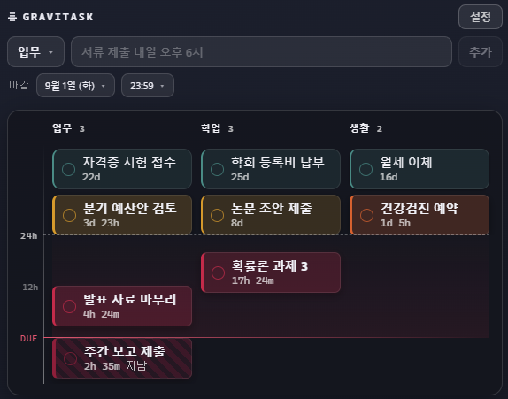

# Gravitask

마감이 다가오는 걸 읽지 않고 **느끼게** 하는 바탕화면 할 일 위젯.
Windows와 macOS에서 돕니다.

할 일은 마감을 향해 떨어집니다. 이름은 거기서 왔습니다.



기존 할 일 위젯은 두 극단으로 갈라져 있습니다. Rainmeter 계열은 예쁘지만 할 일
관리가 안 되고, Microsoft To Do 계열은 기능은 완전하지만 "3일 남음"을 글자로
알려줄 뿐 시각적 압력이 없습니다. 이 프로젝트는 그 사이를 노립니다.

마감이 가까울수록 카드가 아래로 내려오고, 색이 짙어지고, 모서리가 날카로워지고,
표기가 "9일 남음"에서 "23:59까지"로 바뀝니다. 색 하나에만 기대지 않으므로 색각
이상이 있어도 급한 것이 급해 보입니다.

## 받기

[**Releases**](https://github.com/minstaar/gravitask/releases)에서 받으세요.

| | 파일 | 요구 사항 |
| --- | --- | --- |
| Windows | `Gravitask_x.y.z_x64-setup.exe` | Windows 10 이상 |
| macOS | `Gravitask_x.y.z_universal.dmg` | macOS 10.15 이상. Intel·Apple Silicon 공용 |

설치 뒤에는 앱이 스스로 새 버전을 확인하고, 설정 화면에서 업데이트할 수
있습니다.

### 첫 실행에서 경고가 뜹니다

코드 서명 인증서가 없어서 두 OS 모두 낯선 앱으로 봅니다. 한 번만 넘기면 그
뒤로는 그냥 열립니다.

- **Windows** — SmartScreen 경고에서 `추가 정보` → `실행`
- **macOS** — 응용 프로그램 폴더에서 `Gravitask`를 **우클릭 → 열기**, 한 번 더
  `열기`. 그래도 막히면 터미널에서
  `xattr -dr com.apple.quarantine /Applications/Gravitask.app`

## 쓰는 법

**할 일 추가** — 한 줄로 적습니다. `서류 제출 내일 오후 6시`처럼 쓰면 제목과
마감을 알아서 나눕니다. 파싱 결과는 입력줄 아래 `마감`·`반복` 칩에 드러나고,
직접 고치면 그쪽이 우선합니다.

그 두 줄은 평소에 접혀 있다가 위젯에 손을 올리거나 입력칸에 커서를 두면
펼쳐집니다. 펼쳐지는 동안 기둥은 화면에서 움직이지 않습니다 — 창이 대신
비켜 줍니다.

**완료** — 카드 왼쪽 동그라미. 잘못 눌렀으면 `Ctrl`+`Z`(macOS `⌘`+`Z`).

**반복** — `반복` 칩에서 `매일`·`매주`·`격주`·`매월`을 고릅니다. 주간 반복은
어느 요일에 오는지 직접 켭니다(`월`·`수` 수업이면 둘 다). 횟수는 `계속`이
기본이고 `5`·`10`·`15`·`30`회나 직접 적은 숫자로 끝을 정할 수 있습니다.

한 줄 입력으로도 됩니다 — `매주 월요일 알고리즘 과제`, `평일 스탠드업 오전 10시`,
`매월 1일 월세`, `3일마다 화분 물 주기`.

회차를 미리 만들어 두지 않습니다. 카드는 언제나 **다음 회차 한 장**이고,
완료하면 그 자리에서 다음 날짜로 굴러갑니다. 매주 수업 다섯 과목을 한 학기
걸어도 레인에는 다섯 장뿐입니다. 놓친 회차는 건너뛰되 남은 횟수에서는
깎습니다 — 열다섯 번 있는 수업은 안 갔어도 열다섯 번입니다.

이번 주만 건너뛰려면 카드를 우클릭해 `이번 회차 건너뛰기`. 한 것으로 치지
않으니 기록에 남지 않고, 다음 회차로 굴러갑니다. 이번 주만 다른 날로 미루려면
`수정`에서 날짜만 바꾸면 됩니다 — 규칙은 그대로라 다음 회차는 원래 자리로
돌아옵니다.

아주 끝내려면 `반복 끝내기`. 규칙만 떨어지고 아직 안 한 이번 회차는 카드로
남습니다.

**수정·삭제** — 카드 우클릭.

`수정`을 누르면 그 항목이 위 입력칸으로 돌아옵니다. 제목·주제·마감이 모두
실리고 버튼이 `수정`으로 바뀌며, 고치는 중인 카드에는 테두리가 붙습니다.
그 테두리가 붙어 있는 동안 그 카드는 완료되지 않습니다. 나가려면 `취소` 또는
`Esc`.

`삭제`는 확인을 묻지 않습니다. 완료와 같이 `Ctrl`+`Z`로 돌아옵니다.

**전역 단축키** — `Ctrl`+`Alt`+`G`. 어디서든 위젯을 띄우고 입력칸에 커서를
둡니다. 수정 중이었다면 그 상태를 놓고 새 할 일 입력으로 돌아옵니다.

**크기 조절** — `Ctrl`+휠 (macOS `⌘`+휠 또는 트랙패드 확대). 창 위치는
기억되고, 크기는 내용에 맞춰 매번 계산합니다.

**설정** — 위젯 상단의 `설정`. 주제 이름 변경·순서 이동·추가·삭제(할 일이 남은
주제는 지울 수 없습니다), 배율, 한 화면에 볼 주제 수, 캘린더 연동, 알림이
여기 있습니다.

**트레이 메뉴** — 위젯은 항상 다른 창 뒤에 깔리고 작업표시줄(macOS는 Dock)에도
뜨지 않으므로, 트레이가 되찾는 수단입니다. macOS에서는 메뉴 막대 오른쪽입니다.
`위젯 보이기` / `숨기기` / `맨 앞에 고정` / `로그인 시 자동 시작` / `종료`.

> **위젯을 잃어버렸으면 앱을 다시 실행하세요.** 두 개가 뜨지 않고 원래 있던
> 위젯이 나타납니다. 바로가기든 Spotlight든 상관없습니다.
>
> macOS에서 특히 그렇습니다. 메뉴 막대는 자리가 모자라면 아이콘을 말없이
> 숨기는데, Windows 트레이처럼 넘친 것을 모아 주는 버튼이 없어서 되찾는
> 손잡이가 통째로 사라질 수 있습니다.

## 캘린더 연결

구글·애플 캘린더의 **비공개 iCal(ICS) 주소**를 등록하면 일정이 자동으로
들어옵니다. 설정 화면에 주소 얻는 경로가 적혀 있습니다.

주소는 사실상 비밀번호라 앱의 화면 쪽으로는 넘기지 않습니다. Windows에서는 OS
자격 증명 저장소에, macOS에서는 앱 데이터 폴더의 파일에 둡니다. 왜 갈랐는지는
[DESIGN.md](DESIGN.md#캘린더는-왜-ics인가)에 있습니다.

구독한 일정은 **읽기 전용**입니다. 완료 체크는 되지만 수정·삭제는 되지
않습니다 — 원본 캘린더에서 고쳐야 합니다.

## 알려진 제약

- **바탕화면 유지 동작은 환경에 따라 다를 수 있습니다.** Windows에서는 포커스가
  없을 때 '바탕화면 바로 위'로 자리를 되돌려 `Win`+`D`를 견디는데, 다른 셸
  확장(Fences, 배경화면 엔진 등)과 z-order를 두고 다툴 수 있습니다.
- **서명 인증서가 없어** 처음 받아서 실행할 때 경고가 뜹니다. 한 번 넘기면
  그 뒤로는 앱이 직접 받는 업데이트라 다시 뜨지 않습니다.
- **macOS에서 캘린더 주소는 암호화되지 않은 파일에 있습니다.** 같은 계정으로
  도는 다른 앱이 읽을 수 있습니다. 새는 것은 그 캘린더를 **읽는** 권한 하나이고
  계정이나 쓰기 권한은 아닙니다. 키체인을 쓰면 막히지만, 그러면 업데이트마다
  로그인 암호를 묻게 됩니다 — 왜 이쪽을 골랐는지는 DESIGN.md에 있습니다.
- **활주로가 붐비면 시간 위치가 어긋납니다.** 카드가 겹치지 않도록 밀어내는데,
  그만큼 "같은 높이 = 같은 시간"이 깨집니다. 정확한 값은 카드의 "N시간 남음"이
  알려줍니다.

## 개발

```bash
npm install
npm run tauri dev  # 실제 위젯 (Rust 툴체인 필요)
npm run dev        # 브라우저에서 UI만 (http://localhost:5273)
npm run check      # 타입 검사
npm test           # 파싱 · 표기 · 배치 명세
```

`npm run dev`는 가짜 바탕화면 위에 위젯을 띄웁니다. UI 작업은 재빌드가 없어
이쪽이 훨씬 빠릅니다. 다만 투명 창과 트레이는 `tauri dev`에서만 볼 수 있습니다.

Tauri 2 + Svelte 5 + TypeScript. 색·치수·모션은 `src/lib/theme.json` 한 곳에
모여 있어서, 그 파일만 고쳐도 테마를 바꿀 수 있습니다.

설계 결정과 그 배경은 [DESIGN.md](DESIGN.md)에 있습니다.

## 라이선스

[MIT](LICENSE)
